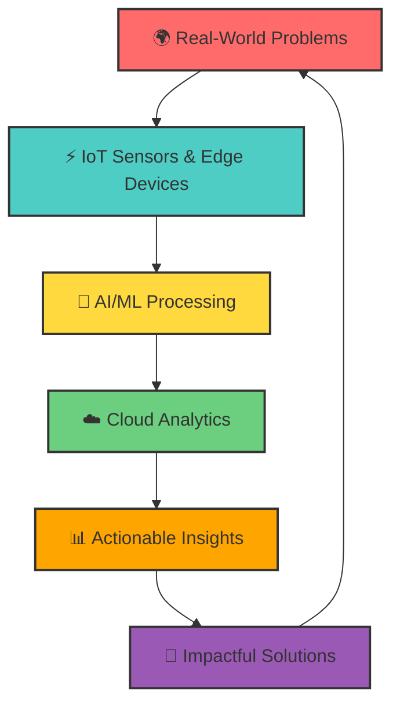
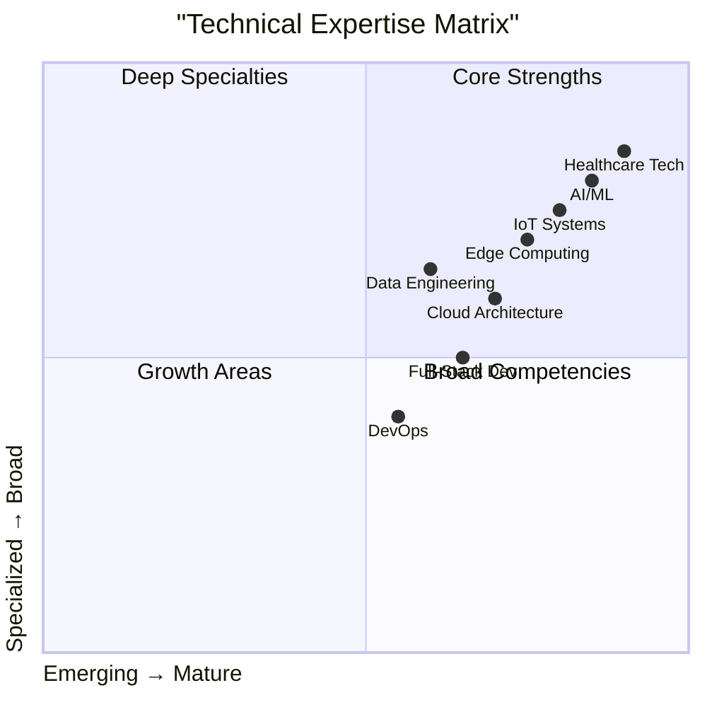
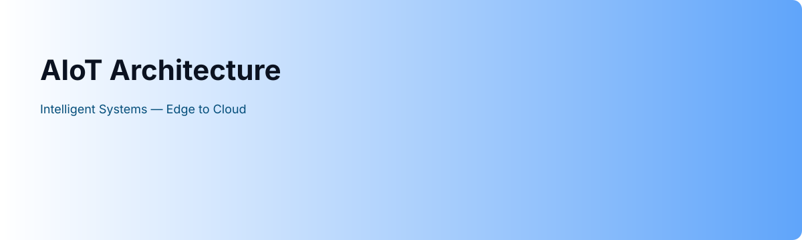

#  **AIoT Innovator & Edge Intelligence Architect**  

<picture>
  <source media="(prefers-color-scheme: dark)" srcset="./output/github-contribution-grid-snake-dark.svg">
  <source media="(prefers-color-scheme: light)" srcset="./output/github-contribution-grid-snake-light.svg">
  
</picture>

### **PETER MURAYA NDUNGU**  
### *Where Intelligence Meets Infrastructure*  

<!-- Enhanced Badges Section -->

  
  
  
  

---

## 🎯 **Introduction**

<!-- Main Typing SVG -->

<!-- Secondary Typing SVG -->

  

---

## 🌟 **Professional Identity**

  
<!-- Mermaid Flowchart -->

**Visionary Engineer** pioneering the fusion of **Artificial Intelligence** and **Internet of Things** at the edge. Building scalable, intelligent systems for **Healthcare Transformation**, **Smart Urban Ecosystems**, and **Sustainable Development** across Africa and beyond.

---

## 🛠️ **Tech Stack & Expertise**

<!-- Tech Stack Icons Grid -->
<table>
  <tr>
    <td align="center">
      
       <b>Python</b>
    </td>
    <td align="center">
      
       <b>TensorFlow</b>
    </td>
    <td align="center">
      
       <b>Node.js</b>
    </td>
    <td align="center">
      
       <b>React</b>
    </td>
    <td align="center">
      
       <b>Docker</b>
    </td>
    <td align="center">
      
       <b>Kubernetes</b>
    </td>
  </tr>
  <tr>
    <td align="center">
      
       <b>Raspberry Pi</b>
    </td>
    <td align="center">
      
       <b>AWS</b>
    </td>
    <td align="center">
      
       <b>PostgreSQL</b>
    </td>
    <td align="center">
      
       <b>Grafana</b>
    </td>
    <td align="center">
      
       <b>Arduino</b>
    </td>
    <td align="center">
      
       <b>FastAPI</b>
    </td>
  </tr>
</table>

---

## 🚀 **Featured Innovations**

<!-- Projects Table -->
<table>
  <thead>
    <tr>
      <th>Project</th>
      <th>Impact</th>
      <th>Status</th>
      <th>Tech Stack</th>
    </tr>
  </thead>
  <tbody>
    <tr>
      <td>🏥 <b>NeuralEdge Medical Analyzer</b></td>
      <td>92% TB detection accuracy</td>
      <td>🟢 Live</td>
      <td>PyTorch, ONNX, RPi</td>
    </tr>
    <tr>
      <td>🌆 <b>SmartCity IoT Mesh Network</b></td>
      <td>3 counties real-time monitoring</td>
      <td>🟡 Pilot</td>
      <td>LoRaWAN, TimescaleDB</td>
    </tr>
    <tr>
      <td>🏨 <b>Dynamic Pricing Engine</b></td>
      <td>30% revenue increase</td>
      <td>🟢 Deployed</td>
      <td>Next.js 14, TF.js</td>
    </tr>
    <tr>
      <td>🌱 <b>AgriSense Precision Farming</b></td>
      <td>500+ farmers impact</td>
      <td>🟡 Beta</td>
      <td>ESP32, MQTT, FastAPI</td>
    </tr>
    <tr>
      <td>💡 <b>Energy Optimization AI</b></td>
      <td>25% energy savings</td>
      <td>🟠 R&D</td>
      <td>IoT, ML, Cloud</td>
    </tr>
  </tbody>
</table>

---

## 📈 **GitHub Analytics**

### 📊 **Statistics Overview**

<!-- GitHub Stats Cards -->

  
  <!-- GitHub Stats -->
  
  
  <!-- GitHub Streak Stats -->
  
  

<!-- GitHub Trophies -->

  

### 🔝 **Top Languages & Activity**

  
  <!-- Top Languages -->
  
  
  <!-- Activity Graph -->
  
  

---

## 🎯 **Skill Matrix**

<!-- Mermaid Quadrant Chart -->

---

## 🌐 **Connect & Collaborate**

### 🤝 **Let's Build The Future Together**

<!-- Social Links -->

  
  
  
  
  
  

---

## 📊 **Metrics & Impact**

<!-- Metrics Table -->
<table>
  <thead>
    <tr>
      <th>Metric</th>
      <th>Value</th>
      <th>Status</th>
    </tr>
  </thead>
  <tbody>
    <tr>
      <td><b>Projects Delivered</b></td>
      <td>15+</td>
      <td>🟢 Active</td>
    </tr>
    <tr>
      <td><b>Lines of Code</b></td>
      <td>500K+</td>
      <td>📈 Growing</td>
    </tr>
    <tr>
      <td><b>Communities Impacted</b></td>
      <td>10K+</td>
      <td>🌍 Scaling</td>
    </tr>
    <tr>
      <td><b>Technical Articles</b></td>
      <td>25+</td>
      <td>📚 Published</td>
    </tr>
    <tr>
      <td><b>Open Source Contributions</b></td>
      <td>50+</td>
      <td>🤝 Collaborative</td>
    </tr>
  </tbody>
</table>

---

## 💡 **Innovation Philosophy**

<blockquote style="border-left: 4px solid #00FFFF; padding-left: 15px; font-style: italic; color: #E0E0E0;">
  "Technology should be <b>invisible yet indispensable</b> — enhancing human potential without demanding attention. True innovation lies in <b>elegant simplicity</b> that solves real problems at scale, bridging the gap between cutting-edge research and practical implementation."
</blockquote>

  

---

## 🎨 **Featured Visual**

<!-- Placeholder for custom visual (responsive to theme) -->
<picture>
  <source media="(prefers-color-scheme: dark)" srcset="./assets/banner.svg">
  <source media="(prefers-color-scheme: light)" srcset="./assets/banner-light.svg">
  
</picture>

<i>Intelligent Systems Architecture - Edge to Cloud</i>

---

### ⚡ **Ready to architect the intelligent future?**
### *Let's connect and transform possibilities into reality.*

<!-- Footer Snake (theme-aware) -->
<picture>
  <source media="(prefers-color-scheme: dark)" srcset="./output/github-contribution-grid-snake-dark.svg">
  <source media="(prefers-color-scheme: light)" srcset="./output/github-contribution-grid-snake-light.svg">
  
</picture>

**© 2024 Peter Muraya Ndugu | AIoT Visionary | Building Africa's Digital Future**

  

---
