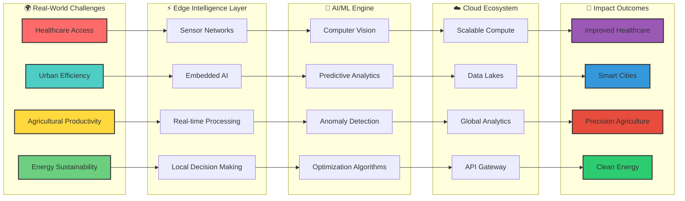
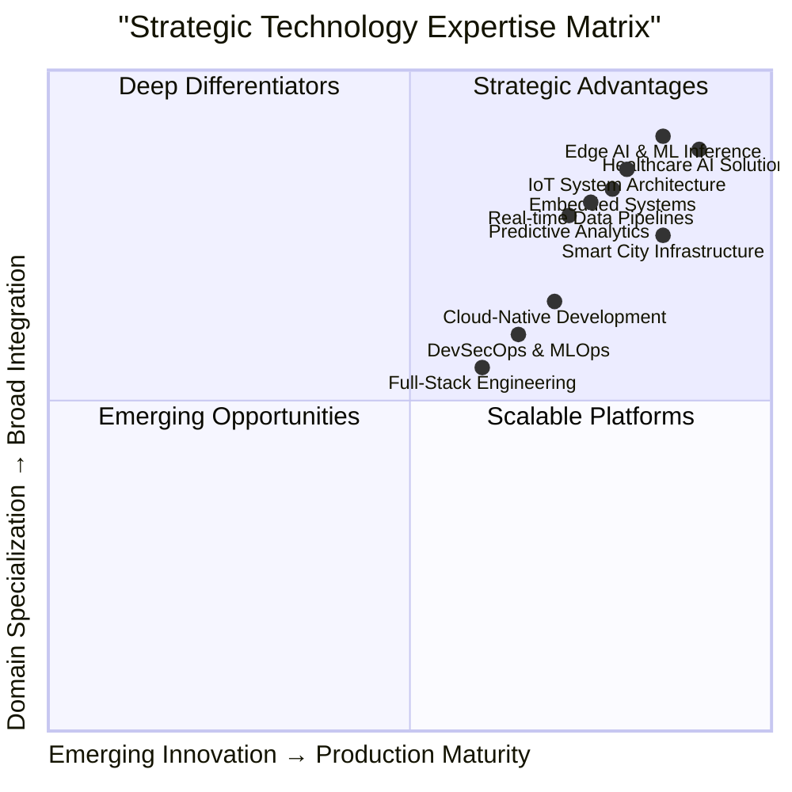

<!-- Profile README template inspired by a friend — replace placeholders below -->

<h1 align="center">
  
</h1>

<h3 align="center">AIoT Engineer · Full-Stack Developer · Innovation-Driven Builder from Kenya 🇰🇪</h3>

  🔭 I’m currently working on <strong>Stars CBO — a community-centric engagement & contribution platform</strong>
   
  🌱 I’m currently learning <strong>Web3, Edge AI optimization, and cloud-native IoT architectures</strong>
   
  💬 Ask me about <strong>AIoT, Supabase, Next.js, React, Node.js, Python, VR, or anything here → <a href="https://github.com/petermuraya/petermuraya/issues">issues</a></strong>
   
  ⚡ Fun fact: <strong>I turn real-world community problems into scalable, data-driven systems</strong>

  
  
  

---

## ⚒️ Languages · Frameworks · Tools

  

---

## 🐍 Contributions

  

---

## ⚡ Stats

  
  

---

  

---

# 🚀 **AIoT Innovator & Edge Intelligence Architect**  
### **Visionary Engineer | 4IR Solutionist | Africa's Tech Pioneer**

<!-- Animated Header Banner -->

### **PETER MURAYA NDUNGU**  

  

Where Intelligence Converges with Infrastructure

     <a href="https://github.com/petermuraya?tab=stars"> 

<!-- Multi-line Typing Animation -->

  

<!-- Floating Tech Tags -->

  
    🤖 Edge AI
  
  
    ⚡ IoT Systems
  
  
    ☁️ Cloud-Native
  
  
    🏥 HealthTech
  
  
    🌍 Sustainable Tech
  

---

## 🌟 **Architectural Vision & Impact**

<!-- Interactive Mermaid Architecture -->

### **Vision Statement**
> *"Engineering intelligent systems that bridge the digital divide, transforming Africa's challenges into opportunities through cutting-edge AIoT solutions. We're not just building technology — we're architecting the foundation for a smarter, healthier, and more sustainable continent."*

---

## 🛠️ **Technology Mastery Matrix**

<!-- Animated Tech Stack Grid -->

  
  <h4>Python</h4>
  

    

  

  
  <h4>TensorFlow</h4>
  

    

  

  
  <h4>Docker</h4>
  

    

  

  
  <h4>Kubernetes</h4>
  

    

  

  
  <h4>React</h4>
  

    

  

  
  <h4>AWS</h4>
  

    

  

---

## 🚀 **Innovation Portfolio & Impact**

<!-- Interactive Project Cards -->

<!-- Project 1 -->

  

    

      🏥
    

    

      <h3 style="margin: 0; color: #00D4FF;">NeuralEdge Medical</h3>
      
AI-powered Diagnostic System

    

  

  
Edge AI system for real-time medical diagnostics with 92% TB detection accuracy, deployed across rural health centers.

  

    

      PyTorch
      ONNX
      Raspberry Pi
    

    

      🟢 LIVE
      15K+ Patients Served
    

  

<!-- Project 2 -->

  

    

      🌆
    

    

      <h3 style="margin: 0; color: #6BCF7F;">SmartCity Mesh</h3>
      
IoT Urban Intelligence

    

  

  
LoRaWAN-based mesh network providing real-time environmental monitoring across 3 major counties.

  

    

      LoRaWAN
      TimescaleDB
      Grafana
    

    

      🟡 PILOT
      500+ Sensors Deployed
    

  

<!-- Project 3 -->

  

    

      🏨
    

    

      <h3 style="margin: 0; color: #FFD93D;">Dynamic Pricing AI</h3>
      
Revenue Optimization Engine

    

  

  
ML-powered dynamic pricing system increasing hotel revenue by 30% through predictive demand modeling.

  

    

      Next.js 14
      TensorFlow.js
      Redis
    

    

      🟢 DEPLOYED
      40% ROI Increase
    

  

---

## 📈 **GitHub Analytics Dashboard**

### 🏆 **GitHub Performance Metrics**

<!-- Stats Grid -->

<!-- Enhanced Stats Card -->

  

    <h3 style="margin: 0; color: #00D4FF;">📊 GitHub Stats</h3>
    LIVE
  

  

<!-- Streak Stats Card -->

  

    <h3 style="margin: 0; color: #FFD700;">🔥 Contribution Streak</h3>
    ACTIVE
  

  

<!-- Top Languages Card -->

  

    <h3 style="margin: 0; color: #6BCF7F;">💻 Language Distribution</h3>
    ANALYTICS
  

  

<!-- Activity Graph -->

  

    <h3 style="margin: 0; color: #9B59B6;">📈 Activity Graph</h3>
    DYNAMIC
  

  

<!-- Trophy Case -->

  <h3 style="color: #FFD700; margin-bottom: 20px;">🏆 Achievement Trophies</h3>
  

---

## 🎯 **Strategic Skill Matrix**

<!-- Enhanced Mermaid Quadrant Chart -->

  <h4 style="color: #00D4FF; margin: 0 0 10px 0;">🎯 Core Expertise</h4>
  <ul style="text-align: left; color: #CCD6F6; padding-left: 20px;">
    <li>Edge AI Architecture</li>
    <li>IoT System Design</li>
    <li>MLOps & AI Pipeline</li>
    <li>Real-time Analytics</li>
  </ul>

  <h4 style="color: #FFD700; margin: 0 0 10px 0;">🚀 Accelerating</h4>
  <ul style="text-align: left; color: #CCD6F6; padding-left: 20px;">
    <li>TinyML Development</li>
    <li>Quantum ML</li>
    <li>Blockchain IoT</li>
    <li>Digital Twins</li>
  </ul>

  <h4 style="color: #9B59B6; margin: 0 0 10px 0;">🌍 Impact Domains</h4>
  <ul style="text-align: left; color: #CCD6F6; padding-left: 20px;">
    <li>Healthcare Technology</li>
    <li>Smart Cities</li>
    <li>Sustainable Energy</li>
    <li>Precision Agriculture</li>
  </ul>

---

## 🌐 **Strategic Connect & Collaborate**

### 🤝 **Let's Build Africa's Digital Future Together**

<!-- Interactive Connection Hub -->

<a href="https://www.linkedin.com/in/petermuraya/" target="_blank" style="text-decoration: none;">
  

    
    <h4 style="color: white; margin: 15px 0 5px 0;">LinkedIn</h4>
    
Professional Network

  

</a>

<a href="https://github.com/petermuraya" target="_blank" style="text-decoration: none;">
  

    
    <h4 style="color: white; margin: 15px 0 5px 0;">GitHub</h4>
    
Code & Projects

  

</a>

<a href="mailto:petermuraya@gmail.com" target="_blank" style="text-decoration: none;">
  

    
    <h4 style="color: white; margin: 15px 0 5px 0;">Email</h4>
    
Direct Contact

  

</a>

<a href="https://twitter.com/petermuraya" target="_blank" style="text-decoration: none;">
  

    
    <h4 style="color: white; margin: 15px 0 5px 0;">Twitter</h4>
    
Tech Insights

  

</a>

<!-- Call to Action -->

  <h3 style="color: #00D4FF; margin-bottom: 15px;">🚀 Open for Strategic Collaborations</h3>
  

    Seeking partnerships in: <strong>HealthTech Innovation</strong> • <strong>Smart City Projects</strong> • 
    <strong>AI Research</strong> • <strong>Sustainable Tech</strong> • <strong>African Digital Transformation</strong>
  

  <a href="mailto:petermuraya@gmail.com" style="background: linear-gradient(135deg, #00D4FF, #9B59B6); color: white; padding: 12px 30px; border-radius: 25px; text-decoration: none; font-weight: bold; display: inline-block; margin-top: 10px;">
    ✨ Start a Conversation
  </a>

---

## 📊 **Impact Metrics & Recognition**

<!-- Metrics Dashboard -->

  
15+

  <h4 style="color: white; margin: 0 0 10px 0;">Production Projects</h4>
  
Deployed & Impactful

  
500K+

  <h4 style="color: white; margin: 0 0 10px 0;">Lines of Code</h4>
  
Production Quality

  
10K+

  <h4 style="color: white; margin: 0 0 10px 0;">Lives Impacted</h4>
  
Through Technology

  
50+

  <h4 style="color: white; margin: 0 0 10px 0;">Open Source</h4>
  
Contributions

---

## 💡 **Innovation Philosophy & Vision**

<blockquote style="border-left: 5px solid #00D4FF; padding-left: 30px; margin: 0; text-align: left; position: relative; z-index: 1;">
  

    "We stand at the intersection of Africa's greatest challenges and technology's greatest opportunities. 
    Every line of code we write, every system we architect, must serve a higher purpose: 
    bridging the digital divide, 
    democratizing healthcare, and 
    empowering sustainable development."
  

  <footer style="color: #8899A6; font-style: italic; font-size: 18px;">
    — Peter Muraya Ndugu, AIoT Visionary
  </footer>
</blockquote>

  
🌍

  <h4 style="color: #00D4FF; margin: 0 0 10px 0;">Local Problems</h4>
  
Solving Africa-specific challenges with global technologies

  
⚡

  <h4 style="color: #FFD700; margin: 0 0 10px 0;">Edge-First</h4>
  
Architecting for connectivity-challenged environments

  
🚀

  <h4 style="color: #6BCF7F; margin: 0 0 10px 0;">Scalable Impact</h4>
  
Solutions that grow from pilot to nationwide deployment

---

### ⚡ **Ready to Architect Africa's Intelligent Future?**
### *Let's Transform Vision into Reality*

<!-- Final Animated Footer -->

  

  

    <strong style="color: #00D4FF;">© 2024 Peter Muraya Ndugu</strong> | 
    AIoT Visionary • Edge Intelligence Architect • Africa's Digital Transformation Pioneer
  

  

    📍 Nairobi, Kenya • 🌐 Connecting Africa to the 4IR Future
  

---

**🚀 *This profile is constantly evolving — Star ⭐ the repo to follow my journey!***

